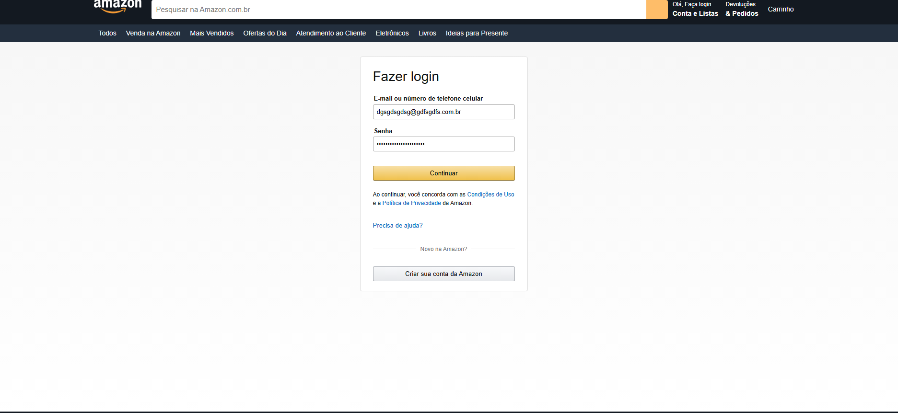
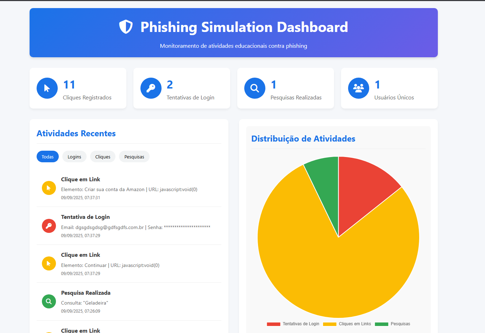

# Phishing Simulation Framework

An educational framework to simulate phishing attacks and raise user awareness about digital security.

## 📋 Description

This project consists of:
1. A cloned Amazon page that simulates a phishing site  
2. A dashboard to monitor user interactions with the page  
3. Scripts to log clicks and login attempts (for educational purposes only)  

## 🚀 How to Use

### Option 1: Local Server
1. Clone this repository  
2. Install a local HTTP server (e.g., `http-server`)  
3. Run `http-server` in the root folder  
4. Access `http://localhost:8080/clone/` to view the phishing page  
5. Access `http://localhost:8080/dashboard/` to view the dashboard  

### Option 2: GitHub Pages
1. Upload the files to your GitHub repository  
2. Enable GitHub Pages in the repository settings  
3. Access `https://yourusername.github.io/repository/clone/`  
4. Access `https://yourusername.github.io/repository/dashboard/`  

## ⚠️ Legal Disclaimer

This project is intended for educational and awareness purposes only. Never use phishing techniques to collect real user data without explicit consent and legal authorization.  

## 🛡️ Educational Purpose

This framework was developed to:
- Demonstrate how phishing attacks work  
- Train users to identify fraudulent websites  
- Raise awareness of the importance of checking URLs  
- Develop threat detection skills  

## 📊 Features

- Realistic Amazon clone page  
- Logging of clicks, login attempts, and searches  
- Dashboard with statistics and visualizations  
- Filters to analyze different types of activity  
- Charts for data visualization  

## 🛡️ Prints

## 🛠️ Technologies Used

- HTML5, CSS3, JavaScript  
- Chart.js for visualizations  
- Font Awesome for icons  
- LocalStorage for data persistence  

## 📝 License

This project is licensed under the MIT License - see the LICENSE file for details.
